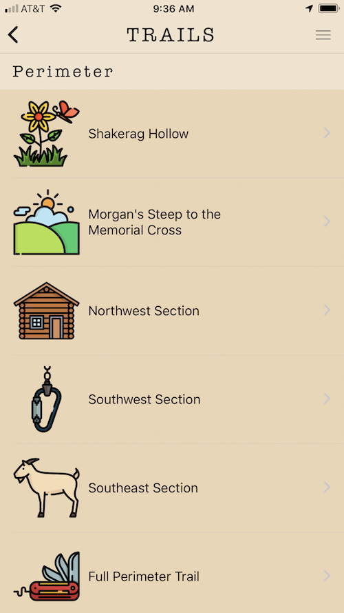
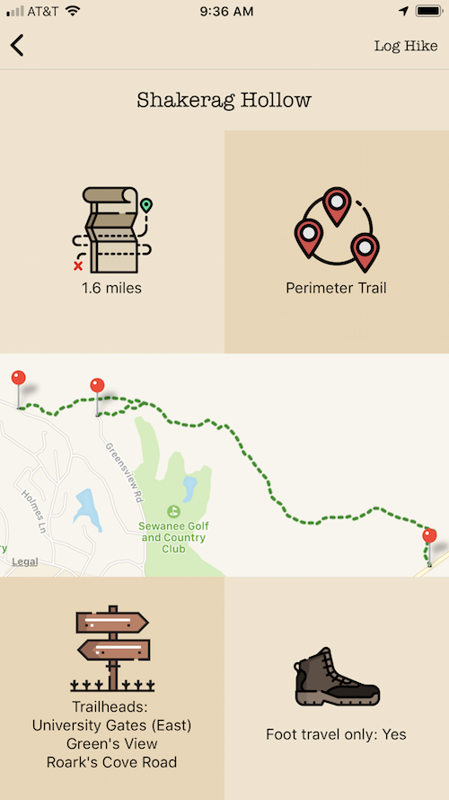
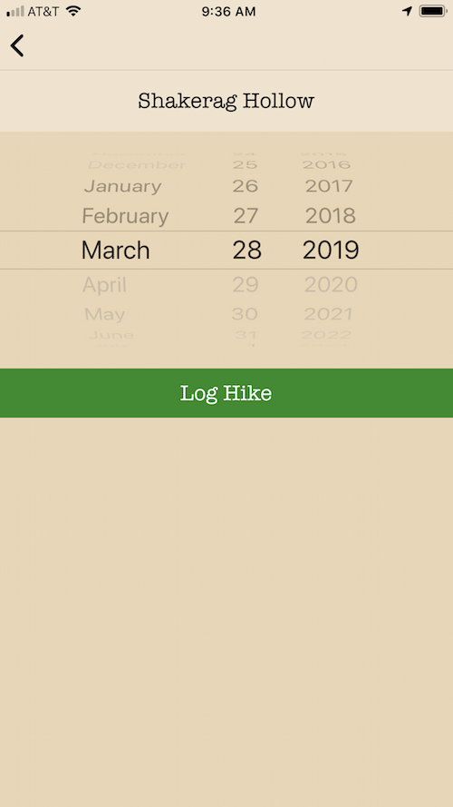

# Perimeter Trail App

* React Native
* Expo (https://expo.io/@kelseyleftwich/perimeter)
* Firebase (Authentication and Storing hikes / teams data)
* Icons made by Freepik from www.flaticon.com is licensed by Creative Commons BY 3.0.  (http://creativecommons.org/licenses/by/3.0/)

Disclaimer: The information contained on Perimeter mobile app (the "Service") is for general information purposes only. It\'s for fun! Make sure you use your common sense when hiking. Consult an expert if you are an unexperienced hiker. Developer assumes no responsibility for errors or omissions in the contents on the Service. In no event shall be liable for any special, direct, indirect, consequential, or incidental damages or any damages whatsoever, whether in an action of contract, negligence or other tort, arising out of or in connection with the use of the Service or the contents of the Service. Developer reserves the right to make additions, deletions, or modification to the contents on the Service at any time without prior notice.

## Screenshots

### List of Trails (Home)

### Trail Segment Detail

### Log Hike

### Team Detail

